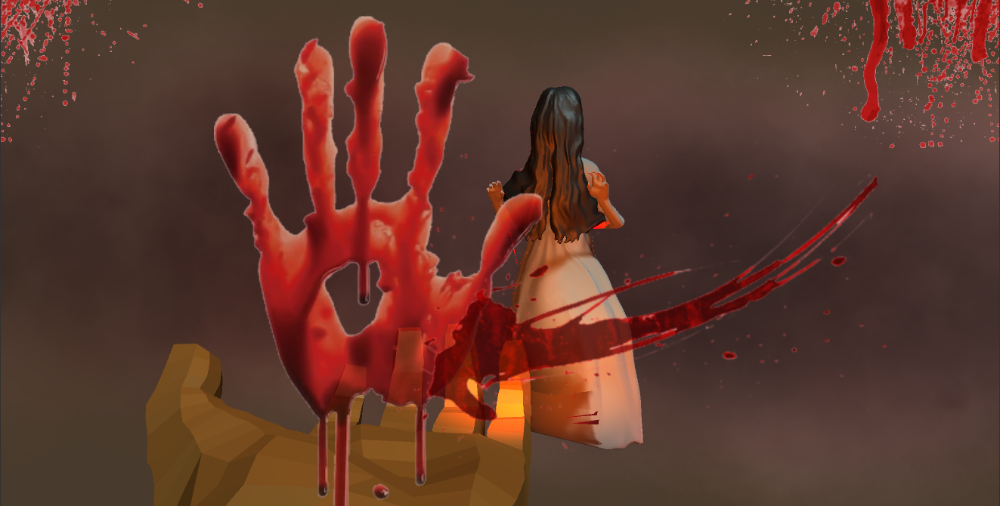
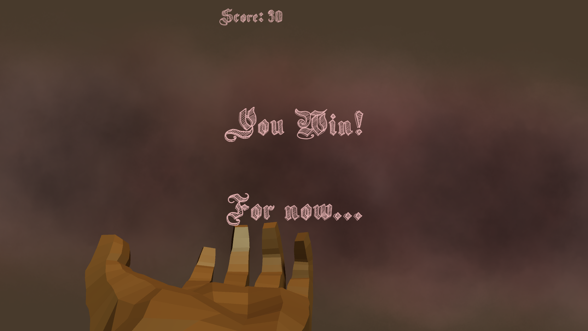
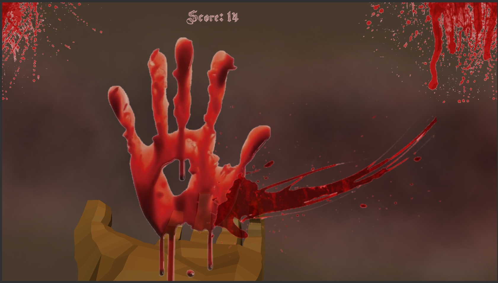

# Samara
Mini Horror Orb Shooter Game with Inductive Chargers

# How does this game work?

While rotating the orb launcher (which you can't see because there is no mesh on it) above the hand model you can determine the direction you want to fire. Push the button under the joystick to have the orb launcher instantiate an orb and launch it. However, if you want to make the orbs bigger, move the inductive chargers closer to each other. The furthest distance they work is 2 cm. The closer they are, the bigger the orb gets. The LED in your circuit is the indicator of the distance of the transformers. The closer they are, the brighter the LED gets and the bigger your shots.

Your goal is to defeat Samara before she kills you. She slowly but surely moves closer to you, randomly teleporting and vanishing all along the way. If your score is more than 30, you beat Samara.

Needless to say, if your score is less than 30 you lose the game.

# License

This project is provided under the [Creative Commons Attribution 4.0 International license](https://creativecommons.org/licenses/by/4.0/). Just make sure to also attribute the following people if you use their resources.

# Resource Attribution

The hand model was created by scribbletoad can be found at https://sketchfab.com/3d-models/hand-low-poly-d6c802a74a174c8c805deb20186d1877 under licence https://creativecommons.org/licenses/by/4.0/

The Samara model was created by CoryRichards can be found at https://sketchfab.com/3d-models/samara-the-ring-57ab1a21d63744dfab12c54c7d139ddb under licence https://creativecommons.org/licenses/by/4.0/

The scary ambiance sound clip was created by ashleyxxpiano can be found at https://freesound.org/people/ashleyxxpiano/sounds/201657/ under license https://creativecommons.org/licenses/by/3.0/

The font was done by Galdino Otten can be found at https://www.dafont.com/theme.php?cat=401 under license https://www.dafont.com/faq.php#copyright

The explosion sound was by Rudmer_Rotteveel can be found at https://freesound.org/people/Rudmer_Rotteveel/sounds/336006/ under license https://creativecommons.org/publicdomain/zero/1.0/
